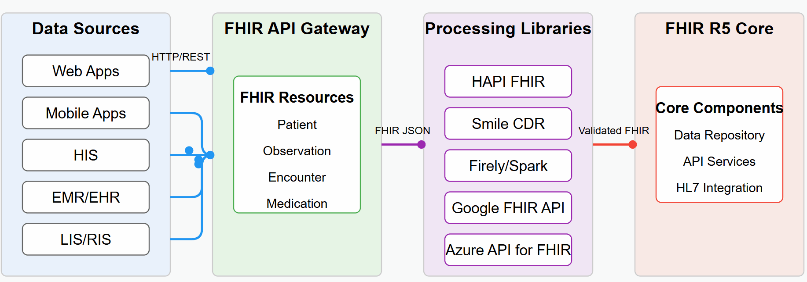

# Welcome

## Chào mừng đến với HL7 FHIR Version 5

FHIR R5 đánh dấu bước tiến quan trọng trong trao đổi dữ liệu y tế, mang đến nền tảng linh hoạt và mạnh mẽ cho khả năng tương tác giữa các hệ thống. Trong thời đại số hóa, dữ liệu y tế đã trở thành nguồn tài nguyên quý giá không kém gì thuốc men hay thiết bị y tế. Giá trị thực sự của dữ liệu chỉ được khai phá khi chúng có thể di chuyển liền mạch giữa các hệ thống, hỗ trợ đưa ra quyết định lâm sàng chính xác, cải thiện chất lượng chăm sóc và cuối cùng là cứu sống người bệnh. FHIR R5 không chỉ là chuẩn kỹ thuật mà còn là chìa khóa để biến tầm nhìn về hệ sinh thái y tế kết nối thành hiện thực.

<figure><figcaption>
HL7 FHIR Flow
</figcaption></figure>

* **Data Sources**: Các nguồn dữ liệu từ Web Apps, Mobile Apps, HIS, EMR/EHR, LIS/RIS
* **FHIR API Gateway**: Cổng giao tiếp chuẩn hóa với FHIR Resources (Patient, Observation, Encounter, Medication...)
* **Processing Libraries**: Các thư viện xử lý như HAPI FHIR, Smile CDR, Firely/Spark, Google FHIR API, Azure API for FHIR
* **FHIR R5 Core**: Nền tảng cốt lõi với Data Repository, API Services và tích hợp HL7

