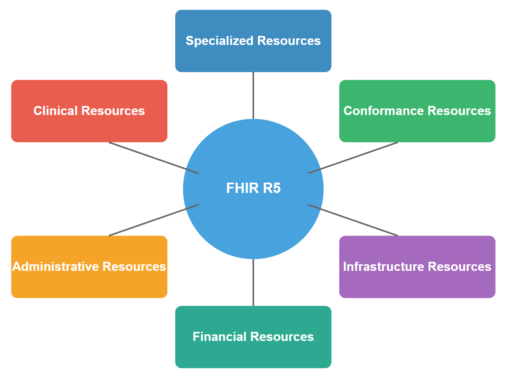

# FHIR R5 Model Resources

FHIR (Fast Healthcare Interoperability Resources) là một tiêu chuẩn được phát triển bởi HL7 nhằm tạo điều kiện thuận lợi cho việc trao đổi dữ liệu y tế giữa các hệ thống khác nhau. Phiên bản R5 là bản cập nhật mới nhất, mang đến nhiều cải tiến quan trọng. Bài viết này sẽ giải thích chi tiết về mô hình tài nguyên trong FHIR R5 cùng với các ví dụ minh họa.

<figure><figcaption><p>Mô hình tài nguyên FHIR R5: Cấu trúc và Ứng dụng</p></figcaption></figure>

### 1. Resource và DomainResource

#### Resource

Resource là khái niệm nền tảng nhất trong FHIR - tất cả thông tin được trao đổi đều được biểu diễn dưới dạng các resource. Mỗi resource đại diện cho một thực thể trong hệ thống y tế như bệnh nhân, cuộc hẹn, kết quả xét nghiệm, thuốc, v.v.

Cấu trúc cơ bản của một Resource bao gồm:

```json
{
  "resourceType": "Patient",
  "id": "example",
  "meta": {
    "versionId": "1",
    "lastUpdated": "2023-05-17T15:45:50Z"
  },
  "language": "vi",
  "implicitRules": "http://example.org/fhir/StructureDefinition/example"
}
```

Trong ví dụ trên:

* `resourceType` xác định loại resource (bắt buộc)
* `id` là định danh duy nhất của resource
* `meta` chứa thông tin về phiên bản và thời gian cập nhật
* `language` xác định ngôn ngữ sử dụng
* `implicitRules` chỉ định các quy tắc xử lý đặc biệt

#### DomainResource

DomainResource kế thừa từ Resource và bổ sung thêm các thuộc tính phong phú hơn. Hầu hết các resource thực tế trong FHIR đều kế thừa từ DomainResource thay vì Resource trực tiếp.

Ví dụ về cấu trúc của một DomainResource:

```json
{
  "resourceType": "Patient",
  "id": "example",
  "meta": {
    "versionId": "1",
    "lastUpdated": "2023-05-17T15:45:50Z"
  },
  "text": {
    "status": "generated",
    "div": "<div xmlns=\"http://www.w3.org/1999/xhtml\">Nguyễn Văn A</div>"
  },
  "extension": [
    {
      "url": "http://example.org/fhir/StructureDefinition/patient-nationality",
      "valueCodeableConcept": {
        "text": "Vietnam"
      }
    }
  ],
  "contained": [
    {
      "resourceType": "Organization",
      "id": "org1",
      "name": "Bệnh viện A"
    }
  ]
}
```

DomainResource bổ sung:

* `text`: phần narrative hiển thị thông tin dạng con người đọc được
* `extension`: cơ chế mở rộng để thêm dữ liệu tùy chỉnh
* `contained`: cho phép nhúng các resource khác trực tiếp

### 2. Resource Identity và Versioning

#### Resource Identity

Mỗi resource trong FHIR đều có một định danh duy nhất, giúp định vị và tham chiếu đến resource đó. Định danh gồm có:

1. **Logical ID**: Một chuỗi ký tự duy nhất trong phạm vi loại resource.
2. **Version ID**: Định danh phiên bản của resource.
3. **Resource Reference**: Đường dẫn đầy đủ đến resource.

Ví dụ về các dạng identity:

* Logical ID: `patient123`
* Version-specific URL: `http://hospital.example.org/fhir/Patient/patient123/_history/2`
* Canonical URL: `http://terminology.hl7.org/CodeSystem/v3-ActCode`

#### Versioning

FHIR hỗ trợ versioning, cho phép theo dõi lịch sử thay đổi của resource. Mỗi khi cập nhật, một phiên bản mới được tạo ra thay vì ghi đè lên phiên bản cũ.

Ví dụ về cách truy cập các phiên bản:

* Phiên bản mới nhất: `GET [base]/Patient/patient123`
* Phiên bản cụ thể: `GET [base]/Patient/patient123/_history/2`
* Lịch sử thay đổi: `GET [base]/Patient/patient123/_history`

```json
// Phiên bản 1
{
  "resourceType": "Patient",
  "id": "patient123",
  "meta": {
    "versionId": "1",
    "lastUpdated": "2023-01-15T10:07:00Z"
  },
  "name": [{"text": "Nguyễn Văn A"}]
}

// Phiên bản 2 (sau khi cập nhật)
{
  "resourceType": "Patient",
  "id": "patient123",
  "meta": {
    "versionId": "2",
    "lastUpdated": "2023-05-20T14:30:00Z"
  },
  "name": [{"text": "Nguyễn Văn A"}],
  "telecom": [{"system": "phone", "value": "0912345678"}]
}
```

### 3. Metadata Elements

Phần tử `meta` chứa thông tin về resource nhưng không phải là dữ liệu y tế trực tiếp. Metadata rất quan trọng cho việc quản lý, truy tìm và xác thực dữ liệu.

Ví dụ về metadata đầy đủ:

```json
"meta": {
  "versionId": "5",
  "lastUpdated": "2023-05-17T15:45:50Z",
  "source": "http://example.org/fhir/Patient/123",
  "profile": [
    "http://hl7.org/fhir/StructureDefinition/Patient-vietnam"
  ],
  "security": [
    {
      "system": "http://terminology.hl7.org/CodeSystem/v3-Confidentiality",
      "code": "N",
      "display": "normal"
    }
  ],
  "tag": [
    {
      "system": "http://example.org/fhir/CodeSystem/record-status",
      "code": "active",
      "display": "Hồ sơ đang hoạt động"
    }
  ]
}
```

Trong đó:

* `versionId`: Số phiên bản của resource
* `lastUpdated`: Thời điểm cập nhật gần nhất
* `source`: Nguồn gốc của resource
* `profile`: Các profile áp dụng cho resource
* `security`: Các nhãn bảo mật
* `tag`: Các tag tùy chỉnh giúp phân loại resource

Ví dụ về việc sử dụng metadata để lọc tìm kiếm:

```
GET [base]/Patient?_security=http://terminology.hl7.org/CodeSystem/v3-Confidentiality|N
```

Truy vấn này sẽ trả về tất cả bệnh nhân có mức bảo mật "normal".

### 4. Narrative

Narrative là phần hiển thị thông tin resource dưới dạng con người đọc được, thường là HTML. Nó đảm bảo ngay cả khi hệ thống nhận không hiểu hết dữ liệu cấu trúc, người dùng vẫn có thể đọc thông tin cơ bản.

Cấu trúc của narrative:

```json
"text": {
  "status": "generated",
  "div": "<div xmlns=\"http://www.w3.org/1999/xhtml\">
    <p>
      <b>Nguyễn Văn A</b>, Nam, 45 tuổi
    </p>
    <p>Địa chỉ: Hà Nội, Việt Nam</p>
    <p>SĐT: 0912345678</p>
  </div>"
}
```

Narrative có hai trạng thái chính:

* `generated`: Được tạo tự động từ dữ liệu cấu trúc
* `additional`: Chứa thông tin bổ sung không có trong dữ liệu cấu trúc

Ví dụ về narrative trong resource Observation:

```json
{
  "resourceType": "Observation",
  "id": "blood-pressure",
  "text": {
    "status": "generated",
    "div": "<div xmlns=\"http://www.w3.org/1999/xhtml\">
      <p>Huyết áp: 120/80 mmHg, đo ngày 17/05/2023</p>
      <p>Bình thường</p>
    </div>"
  },
  "status": "final",
  "code": {
    "text": "Huyết áp"
  },
  "valueString": "120/80 mmHg"
}
```

### 5. Extension Mechanism

FHIR cung cấp cơ chế mở rộng (extension) để bổ sung thông tin không có trong định nghĩa tiêu chuẩn của resource. Điều này cho phép tùy chỉnh và mở rộng mà không phá vỡ cấu trúc cốt lõi.

Có hai loại extension:

* **Extension**: Thêm thông tin không thay đổi ý nghĩa của resource
* **ModifierExtension**: Có thể thay đổi ý nghĩa của resource

Ví dụ về extension đơn giản:

```json
{
  "resourceType": "Patient",
  "id": "patient-with-extensions",
  "extension": [
    {
      "url": "http://example.org/fhir/StructureDefinition/patient-ethnicity",
      "valueString": "Kinh"
    },
    {
      "url": "http://example.org/fhir/StructureDefinition/patient-religion",
      "valueString": "Phật giáo"
    }
  ],
  "name": [{"text": "Nguyễn Văn A"}]
}
```

Extension phức tạp với nhiều giá trị:

```json
{
  "resourceType": "Patient",
  "id": "patient-with-complex-extension",
  "extension": [
    {
      "url": "http://example.org/fhir/StructureDefinition/patient-education",
      "extension": [
        {
          "url": "level",
          "valueString": "Đại học"
        },
        {
          "url": "graduationYear",
          "valueDate": "2015"
        },
        {
          "url": "institution",
          "valueString": "Đại học Y Hà Nội"
        }
      ]
    }
  ]
}
```

ModifierExtension ví dụ:

```json
{
  "resourceType": "Procedure",
  "id": "procedure-with-modifier",
  "modifierExtension": [
    {
      "url": "http://example.org/fhir/StructureDefinition/procedure-not-performed",
      "valueBoolean": true
    }
  ],
  "status": "completed",
  "code": {
    "text": "Mổ ruột thừa"
  }
}
```

Trong ví dụ này, modifierExtension chỉ ra rằng mặc dù thủ thuật được đánh dấu là "completed", nhưng thực tế nó đã không được thực hiện.

### 6. References giữa Resources

FHIR cho phép các resource tham chiếu đến nhau, tạo thành một mạng lưới thông tin liên kết. Có nhiều kiểu tham chiếu:

#### References đơn giản

```json
{
  "resourceType": "Encounter",
  "id": "encounter123",
  "subject": {
    "reference": "Patient/patient123",
    "display": "Nguyễn Văn A"
  },
  "participant": [
    {
      "individual": {
        "reference": "Practitioner/doctor456",
        "display": "Bác sĩ Trần B"
      }
    }
  ]
}
```

Trong ví dụ này:

* `subject` tham chiếu đến một Patient
* `participant.individual` tham chiếu đến một Practitioner

#### Contained Resources

Khi một resource chỉ có ý nghĩa trong ngữ cảnh của resource khác, nó có thể được nhúng trực tiếp:

```json
{
  "resourceType": "MedicationRequest",
  "id": "prescription123",
  "contained": [
    {
      "resourceType": "Medication",
      "id": "med1",
      "code": {
        "text": "Paracetamol 500mg"
      },
      "form": {
        "text": "Viên nén"
      }
    }
  ],
  "medication": {
    "reference": "#med1"
  },
  "subject": {
    "reference": "Patient/patient123"
  },
  "dosageInstruction": [
    {
      "text": "1 viên mỗi 6 giờ khi cần thiết để giảm đau"
    }
  ]
}
```

Lưu ý dấu `#` trong tham chiếu, chỉ ra rằng đây là tham chiếu đến resource có trong phần `contained`.

#### Canonical References

Tham chiếu đến các resource định nghĩa như ValueSet, CodeSystem:

```json
{
  "resourceType": "Observation",
  "id": "obs123",
  "code": {
    "coding": [
      {
        "system": "http://loinc.org",
        "code": "15074-8",
        "display": "Glucose [Moles/volume] in Blood"
      }
    ]
  },
  "value": {
    "CodeableConcept": {
      "coding": [
        {
          "system": "http://terminology.hl7.org/CodeSystem/v3-ObservationInterpretation",
          "code": "H",
          "display": "Cao"
        }
      ]
    }
  }
}
```

Trong ví dụ này, `http://loinc.org` và `http://terminology.hl7.org/CodeSystem/v3-ObservationInterpretation` là canonical URL tham chiếu đến các hệ thống mã hóa.

#### References với bối cảnh (context)

Khi tham chiếu đến một resource trên máy chủ khác:

```json
{
  "resourceType": "Observation",
  "id": "glucose",
  "subject": {
    "reference": "http://hospital.example.org/fhir/Patient/patient123",
    "display": "Nguyễn Văn A"
  }
}
```

#### References với type

Khi không chắc chắn về resource type:

```json
{
  "resourceType": "DocumentReference",
  "id": "doc1",
  "subject": {
    "reference": "Patient/patient123"
  },
  "author": [
    {
      "reference": "Practitioner/doctor456"
    },
    {
      "reference": "Organization/hospital789"
    }
  ],
  "authenticator": {
    "reference": "Practitioner/doctor456"
  }
}
```

### Kết luận

Mô hình tài nguyên FHIR R5 cung cấp một nền tảng mạnh mẽ và linh hoạt cho việc trao đổi dữ liệu y tế. Với cấu trúc resource chuẩn hóa, cơ chế versioning, metadata phong phú, narrative thân thiện với người dùng, khả năng mở rộng và tham chiếu linh hoạt, FHIR đáp ứng được hầu hết các nhu cầu trao đổi thông tin trong lĩnh vực y tế.

Các tổ chức y tế có thể ứng dụng FHIR để xây dựng các hệ thống tương tác liền mạch, từ đó cải thiện chất lượng chăm sóc, giảm chi phí và nâng cao trải nghiệm của bệnh nhân.
